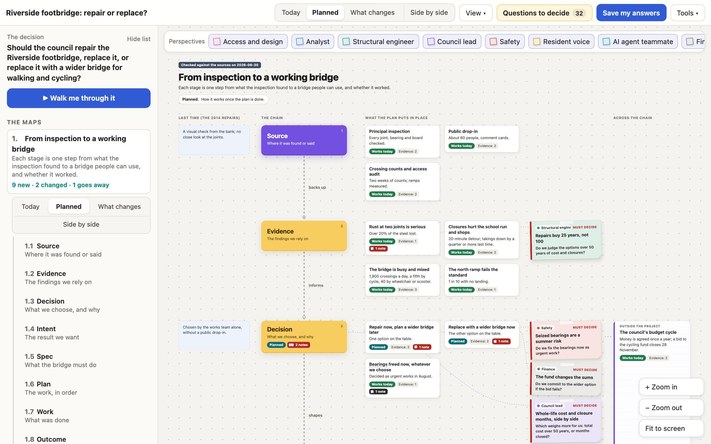
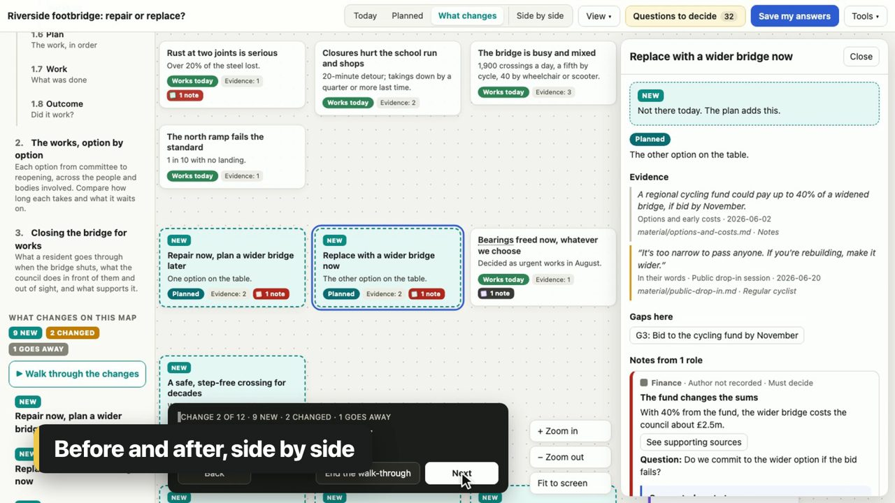
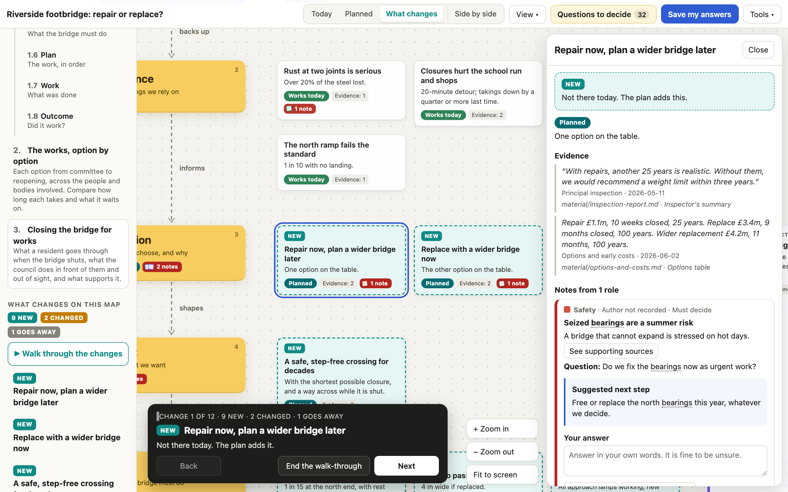
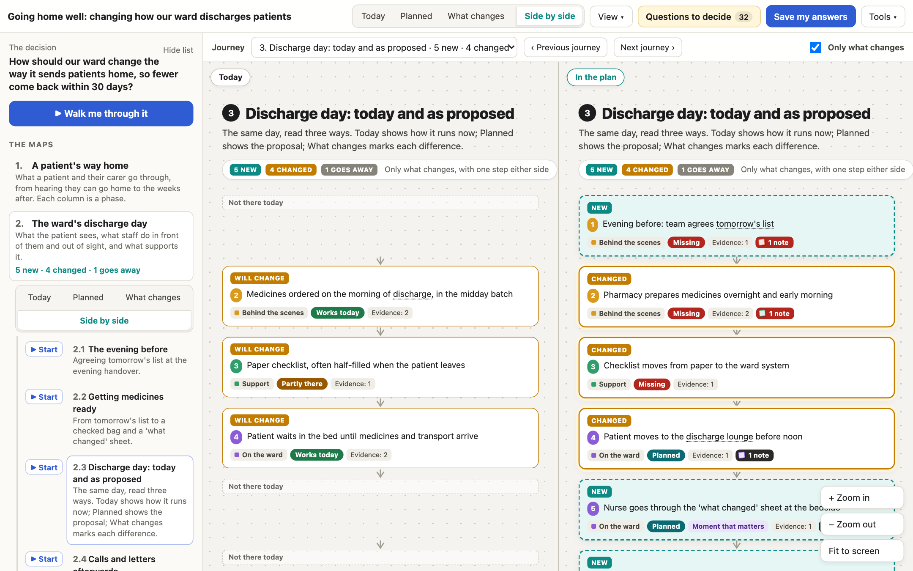
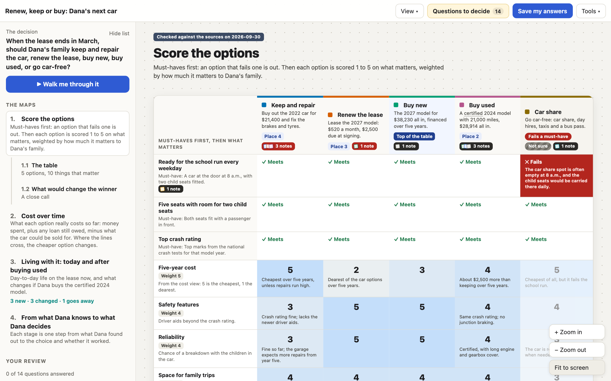
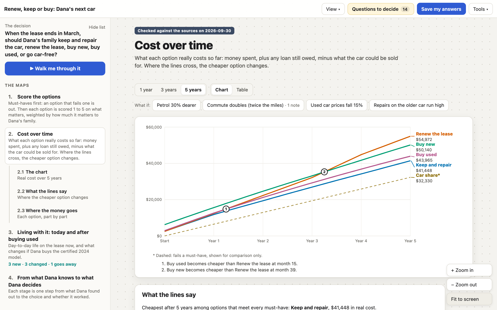
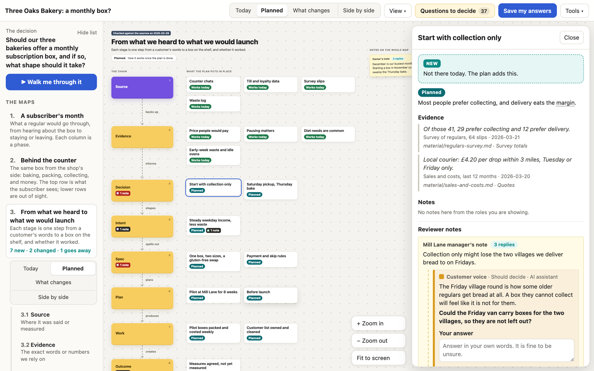

# Decisioncraft

Point Decisioncraft at anything (a codebase, meeting notes, a process or a personal choice) and you get a map of as-is against to-be, the gaps written as user stories, and a sticky note from every role. It's rigorous decision analysis in plain language, from a quick side-by-side to a full team review.

```sh
decisioncraft map ./your-repo --open
```

Decisioncraft reads a codebase, a folder of notes, a page or a plain topic. It draws how things
work today and how they could work, turns the differences into user stories with "done when"
checks, and puts a sticky note from each role beside the boxes it is about: designer, architect,
analyst, engineer, product, security, the customer, an AI agent teammate. Every note ends in a
question. For a choice, big or small, it helps at the right depth: a quick table in the chat, a
few questions and a map, or a full team review. The result is one offline file that people can
read without training.

[](https://michaeljabbour.github.io/amplifier-smart-tool-decisioncraft/examples/engineering.html)

[](https://github.com/michaeljabbour/amplifier-smart-tool-decisioncraft/releases/download/v0.2.0/decisioncraft-trailer-16x9.mp4)

*Above, the footbridge example in Planned view with notes on the map; below it, the trailer.
All examples are fictional. Watch the [90-second trailer](https://github.com/michaeljabbour/amplifier-smart-tool-decisioncraft/releases/download/v0.2.0/decisioncraft-trailer-16x9.mp4) (no sound needed;
[vertical](https://github.com/michaeljabbour/amplifier-smart-tool-decisioncraft/releases/download/v0.2.0/decisioncraft-trailer-9x16.mp4), [square](https://github.com/michaeljabbour/amplifier-smart-tool-decisioncraft/releases/download/v0.2.0/decisioncraft-trailer-1x1.mp4)).*

## Point it at anything

| Point it at | It reads | You get |
|---|---|---|
| a code repository | README, docs, manifests, schemas, routes and entry points, respecting `.gitignore` | today's way with `path:line` evidence, the planned way, gaps as user stories |
| a folder or file of notes, interviews or transcripts | the text, line by line | the same map, quoting the notes |
| a web page | the page's text (only when you allow it, or pass `--page FILE`) | the same map, quoting the page |
| a topic in quotes | two or three answers from you | a first map, clearly marked as not yet checked |

```sh
decisioncraft map ./your-repo --dry-run          # what it will read; no model call
decisioncraft map ./your-repo --complete-cmd 'your-command' --open   # your host's model drafts it
decisioncraft map ./your-repo --starter --dir repo-map   # no model: a digest and a starter to fill in
```

The map opens on the plan with the notes on the map. Switch to **What changes** to see each box
marked New, Changed or Goes away, or **Side by side** to see today and the plan in two panes.
Open any gap for its user stories and "done when" checks.

## Three depths of help

Most choices don't need a map. `triage` says how much help one needs, from four plain things:
how much is at stake, how easy it is to undo, who is affected, and the deadline.

| Mode | For | What happens |
|---|---|---|
| Just answer | small, easy to undo, only you | nothing to build |
| Quick | a real choice that fits in a chat | a scored table, a lean, the one thing to check first; no files |
| Guided | costly or hard to undo | a short interview, one question at a time, then a map to open |
| Team | several groups affected | the full map, every role's notes, reviews and a live session |

```sh
decisioncraft triage --text "my lease is up in March, renew it or just buy the car?"
decisioncraft interview --dir car --question "Renew the lease or buy?"   # one question at a time
decisioncraft quick --option "Renew" --option "Buy" --criterion "must:monthly cost" \
  --criterion "reliability" --score "Renew=monthly cost=3" --score "Buy=monthly cost=4"
```

**How agents recognise it.** The Agent Skill in `skills/decisioncraft/` triggers on "map this
codebase", "show me how X works", "as-is and to-be", "where are the gaps", and on choices that
never use the word decision: "should I…", "torn between", "renew or buy", "keep or replace",
comparing quotes or vendors. It is told to offer, not take over, and to skip factual questions
and trivial picks. We tested this in Claude Code, Codex and Amplifier with vague, real-sounding
prompts; see [docs/HARNESS-TESTS.md](docs/HARNESS-TESTS.md).

## A closer look

| | |
|---|---|
| [](https://michaeljabbour.github.io/amplifier-smart-tool-decisioncraft/examples/engineering.html) **What changes.** One map, every box marked, with a walk through each change and before and after side by side. | [](https://michaeljabbour.github.io/amplifier-smart-tool-decisioncraft/examples/medical.html) **Side by side.** One journey at a time, today and the plan in two panes that pan and zoom together. |
| [](https://michaeljabbour.github.io/amplifier-smart-tool-decisioncraft/examples/personal-car.html) **Scoring table.** Must-haves first, weights you can change live, and "what would change the winner". | [](https://michaeljabbour.github.io/amplifier-smart-tool-decisioncraft/examples/personal-car.html) **Cost over time.** Real cost per option over 1, 3 or 5 years, break-even points in words, and what-ifs. |
| [](https://michaeljabbour.github.io/amplifier-smart-tool-decisioncraft/examples/business.html) **Ask the experts.** Stick a rough note on any box; each role replies with a short view and a question. | **Also:** evidence beside every claim, gaps ranked by impact and effort, decisions with owners and due dates, dot-voting, merged reviews that show agreement and splits, "what changed since last time", and outcomes that feed back as evidence. |

## The examples

All names, quotes and figures are invented, except the cited public figures in the car example.

| Example | The question | Shows | Open it |
|---|---|---|---|
| [map](examples/bike-hire-map/) | How does a small bike hire app work today, and what is missing? Made by pointing `map --starter` at a made-up repo. | as-is / to-be journeys, gaps with stories, a note from every role | [canvas](https://michaeljabbour.github.io/amplifier-smart-tool-decisioncraft/examples/bike-hire-map.html) |
| [car](examples/personal-car/) | When the lease ends: keep, renew, buy new, buy used, or go car-free? | scoring table, cost over time with what-ifs, today and after, pre-mortem | [canvas](https://michaeljabbour.github.io/amplifier-smart-tool-decisioncraft/examples/personal-car.html) |
| [business](examples/business/) | Should a three-shop bakery offer a monthly box? Includes two reviews, rough notes and expert replies. | customer journey, service blueprint, decision chain | [canvas](https://michaeljabbour.github.io/amplifier-smart-tool-decisioncraft/examples/business.html) |
| [technical](examples/technical/) | Move file uploads to a new storage provider, change how uploads reach storage, or both? Includes an earlier version. | system journeys, opportunity tree, what changed | [canvas](https://michaeljabbour.github.io/amplifier-smart-tool-decisioncraft/examples/technical.html) |
| [engineering](examples/engineering/) | Repair, replace, or replace a footbridge with a wider one? | decision chain, system journeys, service blueprint | [canvas](https://michaeljabbour.github.io/amplifier-smart-tool-decisioncraft/examples/engineering.html) |
| [medical](examples/medical/) | How should a ward change the way it sends patients home, so fewer come back? **Not medical advice; no patient data.** | customer journey, service blueprint | [canvas](https://michaeljabbour.github.io/amplifier-smart-tool-decisioncraft/examples/medical.html) |

`decisioncraft example NAME --open` copies any of them (`map`, `car`, `business`, `technical`,
`engineering`, `medical`). Rebuild every output with `python3 scripts/build-examples.py`.

## Install

```sh
uv tool install "amplifier-smart-tool-decisioncraft[smart,mcp] @ git+https://github.com/michaeljabbour/amplifier-smart-tool-decisioncraft"
decisioncraft doctor
```

Python 3.11 or later. `[smart]` is only needed for `--provider` on the two model-backed
commands, and `[mcp]` only for `decisioncraft mcp`. `doctor` checks your setup, never calls
a model, and says exactly what to fix. You can also run straight from a checkout:
`python3 bin/decisioncraft.py`.
## Use it from your agent

- **Claude Code:** copy `skills/decisioncraft/` into `.claude/skills/` (project) or
  `~/.claude/skills/` (everyone). Claude finds it when a conversation needs it.
- **Codex:** add the body of `skills/decisioncraft/SKILL.md` to your `AGENTS.md`, or point
  `AGENTS.md` at it.
- **Amplifier:** add the skill directory to a bundle's skills, or keep it in `.amplifier/skills/`.
- **Any MCP host:** `decisioncraft mcp` serves the tools (map, triage, quick, interview,
  render, review notes and more), the prompts `map_this`, `decide`, `compare_options`,
  `what_could_go_wrong`, `regret_test` and `review_canvas`, and resources for templates, roles,
  the model format and the writing guide. See [docs/HOSTS.md](docs/HOSTS.md).

An agent that can't route a model to Decisioncraft writes the model itself: `decisioncraft
guide` prints every field with its rules, and `validate` checks the result.

## Quick start

```sh
decisioncraft                               # a short start screen
decisioncraft example medical --open        # copy a worked example and open it
decisioncraft new                           # a few questions, then a starter folder
decisioncraft render model.json --open      # draw your model
decisioncraft render model.json --watch     # draw again every time you save
```

`new` asks questions only in a terminal. Scripts and agents pass flags instead:

```sh
decisioncraft new --question "How do we cut missed pickups by half?" \
  --template customer-journey --roles owner,voice,finance --dir pickups
decisioncraft validate pickups/model.json
decisioncraft render pickups/model.json --out pickups/canvas.html

# or draft it from your material with a model (costs tokens; read the result)
cp notes/*.md pickups/material/
decisioncraft draft pickups/material/*.md --question "How do we cut missed pickups by half?" \
  --complete-cmd 'python3 my_adapter.py' --out pickups/model.json
#   ...or --provider anthropic --model <model-name>, with ANTHROPIC_API_KEY set

# after the review
decisioncraft merge pickups/model.json review-*.json --out merged.json
decisioncraft render pickups/model.json --merged merged.json --open
decisioncraft words pickups/model.json --out pickups/model.md
```

Every command has a short summary (`-h`) and a full guide written for agents (`--help`).
Add `--json` to any command for one machine-readable result on stdout, errors included;
the exit code always matches (0 finished, 1 input problem, 2 wrong command line, 3 set
something up first, 4 model call failed). See [contracts/cli.v1.md](contracts/cli.v1.md).

From Python, every capability takes and returns plain data:

```python
import json, decisioncraft as dc
model = json.load(open("model.json"))
problems = dc.validate(model)
html = dc.render(model)
merged = dc.merge([json.load(open(p)) for p in ["a.json", "b.json"]], model)
```
## Review with an agent

When the agent starts the review on your computer, use a local session:

```sh
decisioncraft session model.json --dir .work/review --open --until-finished
```

Answers save automatically. **Save and continue** keeps your answer before moving to the
next question. **Finish review** tells the waiting agent the review is ready. The agent
gets the answers directly; you do not need to download or attach a file. You still make
the final decision. Starting a session does not by itself mean the review is finished.

The command prints the local address and where it keeps the answers. Leave it running
while reviewing. Use a new folder for each session; pass `--review review.json` to continue
an earlier review. `--prepared-by` can identify the actual author when the notes omit one.
The session accepts requests only from this computer. Source links show only the files
inside `--source-root` (the current folder by default), or open a source website when asked.
No provider credentials are needed.
## Finish an offline review

1. Open **Questions to decide**, then **Answer questions**. You see one question at a time.
   Write an answer, or choose **Not sure yet**. The suggested next step is visible; supporting sources have a clear link. Use **Check my answers** to see what you have said and what remains open.
2. Press **Save my answers** in the top bar. This downloads a review file; it does not send it.
   You can save a partial review. Browser storage keeps your work when available.
3. Send the file to the review owner, or attach it to the agent chat that started the review.
4. The owner runs `merge` and `render --merged`, reads the answers, and records the decision.
   A review response does not by itself decide anything.

For a meeting on paper, choose **More → Print the questions**. The handout leaves room
for individual answers and the owner's final choice and reason.

Box positions are automatic. Drag empty space to move the view; click a box to read it.
## Personal decisions

For a car, a home, a job offer or a supplier, the `personal-decision` template gives a light
chain, today and after the change, a **scoring table** (must-haves first; weighted scores 1-5;
"what would change the winner" computed, never guessed) and **cost over time** (money spent,
plus loan still owed, minus what it is worth, plus what the cash could have earned; break-even
points in words; what-ifs). See the car example and `decisioncraft guide`.

## Roles and templates

A model's `roles` list sets who speaks. Each role has an id, a label, a colour, the
question it always asks, and optional jobs to be done. Notes point at a role by id.

A model holds one or more `maps`, each using one template. Journey templates draw lanes
(columns) and numbered steps; steps can carry a pain point, a feeling, and a "moment that
matters" mark. The decision chain draws stages with items for today and planned. The
opportunity tree draws an outcome, needs, ideas and quick tests. Run
`decisioncraft templates` for the list and `decisioncraft new` to see each shape.
## What is model-backed

| Capability | Kind |
|---|---|
| `map --dry-run`, `map --starter`, `triage`, `quick` (with options given), `interview`, `example`, `new`, `render`, `doctor`, `session`, `questions`, `merge`, `diff`, `words`, `validate`, `handoff`, `discover`, `guide`, `templates`, `roles`, `manifest`, `mcp` | deterministic; no model, no credentials |
| `map`, `draft`, `perspectives` (and `quick --text`, `triage` reading free text with a model) | model-backed; one of `--complete-cmd` (your host's own model), `--provider` with an API key, a `complete` function from code, or MCP sampling |

Model replies are validated; one repair is attempted; the result still needs a person.

## Limits

- Reviews travel as files, or through a local session. There is no live shared editing.
- Answers in the canvas stay in that browser until saved as a file.
- `map` and `draft` read text. Turn slides or spreadsheets into text first; PDFs need a parser.
- A map is only as good as what it read. Boxes the material does not show are marked not sure.
- Layout is automatic. Very large maps (dozens of journeys) are long; split them into several maps.
- The examples are fictional and simplified. The medical example is not clinical guidance.

## Development

```sh
uv run pytest                                   # tests
python3 scripts/check-generic.py                # no personal details, product names or filler words
python3 scripts/build-examples.py               # rebuild example outputs
python3 scripts/check-canvas.py examples/*/canvas*.html   # first-time-user checks (needs Playwright)
python3 scripts/check-review-flow.py                     # save and merge a written answer
python3 scripts/check-session-flow.py                    # local answers reach the agent
```

See [AGENTS.md](AGENTS.md), [the vision](docs/VISION.md) and [the contracts](contracts/README.md).
The product page lives in [site/](site/README.md).
## License

MIT. See [LICENSE](LICENSE).
