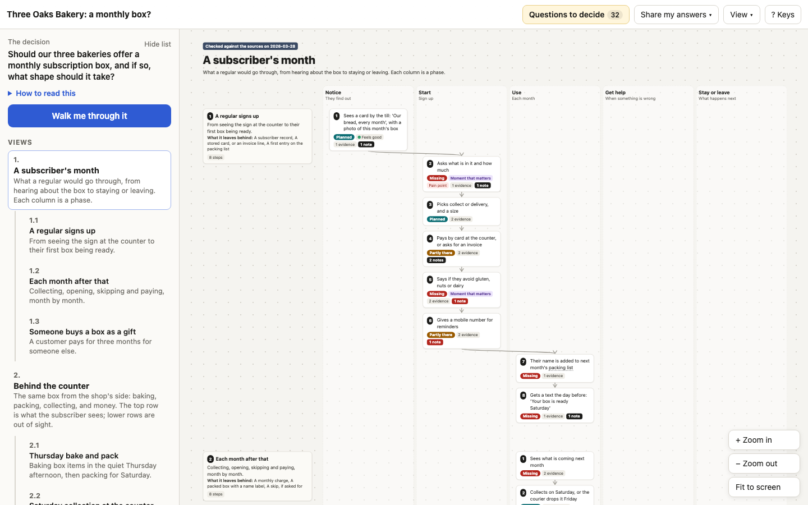

# Decisioncraft

Decisioncraft helps a mixed group make one decision well. It maps how a problem works
today and what is planned, puts the evidence beside every claim, and gathers notes from
every point of view, each ending in a question. The result is one offline file people can
review without training, and a short, ranked list of what to decide.



*Screenshot of the bakery example. All examples are fictional.*

## What you get

- **A map** of the problem. Five templates: system journeys, a customer or patient
  journey, a service blueprint, a decision chain (source, evidence, decision, intent,
  spec, plan, work, outcome), and an opportunity tree.
- **Evidence beside every claim.** Boxes and notes link to the exact words or numbers,
  with source and date. Quotes from customers or patients are marked as their own words.
- **Notes from every point of view.** Default roles: designer, analyst, engineer, product
  owner, security and privacy, customer voice, AI agent teammate, and finance. Rename or
  replace them per decision.
- **Gaps you can rank.** Differences between today and the plan become gaps with user
  stories, "done when" checks, and impact and effort scores.
- **Decisions with owners.** Each has an owner, a status, a due date and who decided.
- **A review loop.** Reviewers answer questions, place dots on what matters most and save
  their answers as a file. `merge` shows where people agree and disagree.
- **What changed.** `diff`, or `render --since`, marks new and changed boxes before a
  follow-up review. Boxes not checked for a while say so.
- **Did it work?** Outcome measures, and results that feed back as evidence.

The canvas is one HTML file. It works offline, makes no requests, and opens with a
numbered list of views, a "Walk me through it" tour, labelled zoom buttons, and a panel
where people read notes and answer.

## Install

```sh
uv tool install "amplifier-smart-tool-decisioncraft[smart,mcp] @ git+https://github.com/michaeljabbour/amplifier-smart-tool-decisioncraft"
decisioncraft doctor
```

Python 3.11 or later. `[smart]` is only needed for `--provider` on the two model-backed
commands, and `[mcp]` only for `decisioncraft mcp`. `doctor` checks your setup, never calls
a model, and says exactly what to fix. You can also run straight from a checkout:
`python3 bin/decisioncraft.py`.

## Quick start

```sh
decisioncraft                               # a short start screen
decisioncraft example medical --open        # copy a worked example and open it
decisioncraft new                           # a few questions, then a starter folder
decisioncraft render model.json --open      # draw your model
decisioncraft render model.json --watch     # draw again every time you save
```

`new` asks questions only in a terminal. Scripts and agents pass flags instead:

```sh
decisioncraft new --question "How do we cut missed pickups by half?" \
  --template customer-journey --roles owner,voice,finance --dir pickups
decisioncraft validate pickups/model.json
decisioncraft render pickups/model.json --out pickups/canvas.html

# or draft it from your material with a model (costs tokens; read the result)
cp notes/*.md pickups/material/
decisioncraft draft pickups/material/*.md --question "How do we cut missed pickups by half?" \
  --complete-cmd 'python3 my_adapter.py' --out pickups/model.json
#   ...or --provider anthropic --model <model-name>, with ANTHROPIC_API_KEY set

# after the review
decisioncraft merge pickups/model.json review-*.json --out merged.json
decisioncraft render pickups/model.json --merged merged.json --open
decisioncraft words pickups/model.json --out pickups/model.md
```

Every command has a short summary (`-h`) and a full guide written for agents (`--help`).
Add `--json` to any command for one machine-readable result on stdout, errors included;
the exit code always matches (0 finished, 1 input problem, 2 wrong command line, 3 set
something up first, 4 model call failed). See [contracts/cli.v1.md](contracts/cli.v1.md).

From Python, every capability takes and returns plain data:

```python
import json, decisioncraft as dc
model = json.load(open("model.json"))
problems = dc.validate(model)
html = dc.render(model)
merged = dc.merge([json.load(open(p)) for p in ["a.json", "b.json"]], model)
```

## Review with an agent

When the agent starts the review on your computer, use a local session:

```sh
decisioncraft session model.json --dir .work/review --open --until-finished
```

Answers save automatically. **Save and continue** keeps your answer before moving to the
next question. **Finish review** tells the waiting agent the review is ready. The agent
gets the answers directly; you do not need to download or attach a file. You still make
the final decision. Starting a session does not by itself mean the review is finished.

The command prints the local address and where it keeps the answers. Leave it running
while reviewing. Use a new folder for each session; pass `--review review.json` to continue
an earlier review. `--prepared-by` can identify the actual author when the notes omit one.
The session accepts requests only from this computer. Source links show only the files
inside `--source-root` (the current folder by default), or open a source website when asked.
No provider credentials are needed.

## Finish an offline review

1. Open **Questions to decide**, then **Answer questions**. You see one question at a time.
   Write an answer, or choose **Not sure yet**. The suggested next step is visible; supporting sources have a clear link. Use **Check my answers** to see what you have said and what remains open.
2. Press **Save my answers** in the top bar. This downloads a review file; it does not send it.
   You can save a partial review. Browser storage keeps your work when available.
3. Send the file to the review owner, or attach it to the agent chat that started the review.
4. The owner runs `merge` and `render --merged`, reads the answers, and records the decision.
   A review response does not by itself decide anything.

For a meeting on paper, choose **More → Print the questions**. The handout leaves room
for individual answers and the owner's final choice and reason.

Box positions are automatic. Drag empty space to move the view; click a box to read it.

## The four examples

Each folder in `examples/` holds the input material, the model, the rendered canvas and a
plain-text version. All names, quotes and figures are invented.

| Example | The decision | Templates | Size |
|---|---|---|---|
| [business](examples/business/) | Should a three-shop bakery offer a monthly box? Includes two reviewers' answers and the merged canvas. | customer journey, service blueprint, decision chain | 6 journeys, 44 steps, 6 gaps, 32 notes, 7 sources |
| [technical](examples/technical/) | Move file uploads to a new storage provider, change how uploads reach storage, or both? Includes an earlier version to show what changed. | system journeys, opportunity tree | 6 journeys, 46 steps, 6 gaps, 33 notes, 7 sources |
| [engineering](examples/engineering/) | Repair, replace, or replace a footbridge with a wider one? | decision chain, system journeys, service blueprint | 7 journeys, 51 steps, 6 gaps, 32 notes, 8 sources |
| [medical](examples/medical/) | How should a ward change the way it sends patients home, so fewer come back? About how a team organises its work. **Not medical advice; no patient data.** | customer journey, service blueprint | 7 journeys, 57 steps, 6 gaps, 32 notes, 7 sources |

Each example opens with a short "How to read this" in the list on the left (the optional
`reading` field in the model). Live copies of the four canvases are on the product page.

The models were written by hand to show the format; `draft` produces the same shape from
your own material. Rebuild every output with `python3 scripts/build-examples.py`.

## Roles and templates

A model's `roles` list sets who speaks. Each role has an id, a label, a colour, the
question it always asks, and optional jobs to be done. Notes point at a role by id.

A model holds one or more `maps`, each using one template. Journey templates draw lanes
(columns) and numbered steps; steps can carry a pain point, a feeling, and a "moment that
matters" mark. The decision chain draws stages with items for today and planned. The
opportunity tree draws an outcome, needs, ideas and quick tests. Run
`decisioncraft templates` for the list and `decisioncraft new` to see each shape.

## What is model-backed

| Capability | Kind |
|---|---|
| `example`, `new`, `render`, `doctor`, `session`, `questions`, `merge`, `diff`, `words`, `validate`, `handoff`, `discover`, `templates`, `roles`, `manifest`, `mcp` | deterministic; no model, no credentials |
| `draft`, `perspectives` | model-backed; one of `--complete-cmd` (your host's own model), `--provider` with an API key, a `complete` function from code, or MCP sampling |

Model replies are validated; one repair is attempted; the result still needs a person.

## Limits

- Reviews travel as files. There is no live shared editing.
- Answers in the canvas stay in that browser until saved as a file.
- `draft` reads text. Turn PDFs, slides or spreadsheets into text first.
- Layout is automatic. Very large maps (dozens of journeys) are usable but long; split them
  into several maps.
- The examples are fictional and simplified. The medical example is not clinical guidance.

## Development

```sh
uv run pytest                                   # tests
python3 scripts/check-generic.py                # no personal details, product names or filler words
python3 scripts/build-examples.py               # rebuild example outputs
python3 scripts/check-canvas.py examples/*/canvas*.html   # first-time-user checks (needs Playwright)
python3 scripts/check-review-flow.py                     # save and merge a written answer
python3 scripts/check-session-flow.py                    # local answers reach the agent
```

See [AGENTS.md](AGENTS.md), [the vision](docs/VISION.md) and [the contracts](contracts/README.md).
The product page lives in [site/](site/README.md).

## License

MIT. See [LICENSE](LICENSE).

New drafts choose suitable maps from the supplied material by default (`--template auto`).
An explicit template still works. Customer journeys use a timeline, staff and system
handoffs use lanes, stage flows compare current and proposed work, and alternatives branch.
Optional named connections highlight when a box is selected and remain readable in the
text version. Display icons have labels and show their on or off state.

Start with `decisioncraft discover`, then use the answers to shape the draft. See
[the decision process](docs/DECISION-PROCESS.md) and [host setup](docs/HOSTS.md).
Completion returns an agent handoff with stories, acceptance criteria and an explicit
proposed-state model when supplied; missing requirements remain visible.
